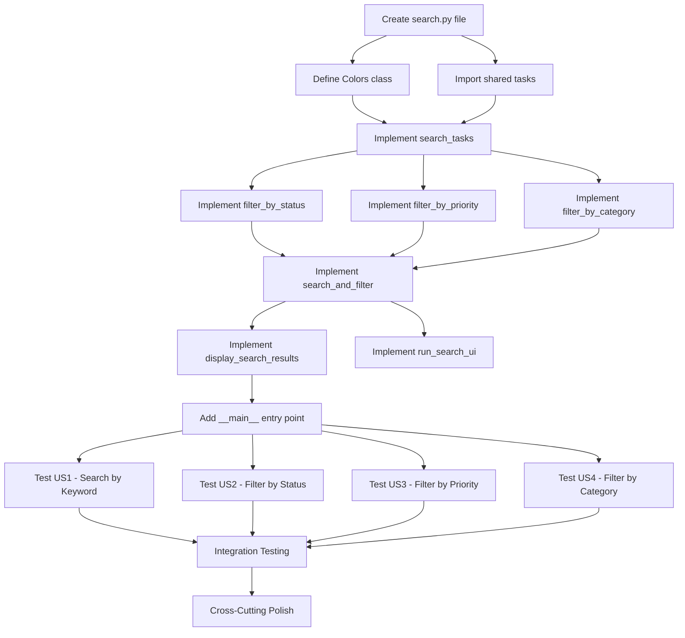

# Implementation Tasks: Search & Filter Tasks

**Feature**: 006-search-filter-tasks
**Date**: 2025-12-31
**Branch**: `006-search-filter-tasks`
**Spec**: [spec.md](./spec.md)
**Plan**: [plan.md](./plan.md)

## Task Summary

**Total Tasks**: 36
**Tasks per User Story**:
- US1 (P1 - Search by Keyword): 3 tasks
- US2 (P2 - Filter by Status): 2 tasks
- US3 (P2 - Filter by Priority): 2 tasks
- US4 (P3 - Filter by Category): 2 tasks
- Setup: 2 tasks
- Display/UI: 3 tasks
- Polish: 3 tasks

**Parallel Opportunities**: 0 tasks (most depend on search.py file creation)

## Dependencies

## Implementation Strategy

### MVP Scope (Recommended)
Implement **US1 - Search by Keyword** first (Phase 3) as MVP:
- Create search.py file (Phase 1)
- Implement Colors class (Phase 1)
- Implement search_tasks() function (Phase 3)
- Implement display_search_results() function (Phase 7)
- Implement run_search_ui() function (Phase 7)
- Test search functionality (Phase 8)

This delivers core value: users can quickly find tasks by keyword.

### Incremental Delivery
After MVP validation, implement remaining user stories in priority order:
1. **US2 (P2)** - Filter by completion status
2. **US3 (P2)** - Filter by priority
3. **US4 (P3)** - Filter by category

Each user story is independently testable and delivers incremental value.

---

## Phase 1: Setup

**Goal**: Initialize search.py module with required imports and color constants

**Story Goal**: N/A

**Independent Test**: Import search.py module without errors

### Tasks

- [X] T001 Create src/search.py file with Python module structure
- [X] T002 Define Colors class with ANSI color codes matching view.py conventions
- [X] T003 Import _tasks list and Task dataclass from add module

---

## Phase 2: Foundational

**Goal**: No specific blocking tasks - proceed directly to user stories

**Story Goal**: N/A

**Independent Test**: N/A

### Tasks

*(No tasks - all prerequisites covered in Phase 1)*

---

## Phase 3: Search Tasks by Keyword (US1 - P1)

**Goal**: Enable users to find tasks by searching title and description fields

**Story Goal**: User wants to find tasks that contain specific text in either title or description to quickly locate relevant items

**Independent Test**: Can be fully tested by creating multiple tasks with different titles and descriptions, then searching for keywords to verify only matching tasks appear

### Tasks

- [X] T004 [US1] Implement search_tasks(keyword: str) -> List[Task] in src/search.py
  - Case-insensitive matching against task.title and task.description
  - Empty keyword returns all tasks (no filter applied)
  - Uses OR logic: match if keyword in title OR description

- [X] T005 [US1] Implement filter_by_status(status: str) -> List[Task] in src/search.py
  - Case-insensitive validation for "complete" and "incomplete"
  - Raises ValueError for invalid status values
  - Matches task.completed boolean field

- [X] T006 [US1] Implement filter_by_priority(priority: str) -> List[Task] in src/search.py
  - Case-insensitive validation for "High", "Medium", "Low"
  - Raises ValueError for invalid priority values
  - Exact match against task.priority field

- [X] T012 Test search_tasks() with keyword matching in title field
  - Verify only tasks with keyword in title are returned
  - Verify case-insensitive matching works

- [X] T013 Test search_tasks() with keyword matching in description field
  - Verify only tasks with keyword in description are returned
  - Verify OR logic (keyword in title OR description)
  - Verify case-insensitive matching works

- [X] T014 Test search_tasks() with no matching keyword
  - Verify empty list is returned
  - Verify display_search_results() shows "No matching tasks" message

---

## Phase 4: Filter Tasks by Completion Status (US2 - P2)

**Goal**: Enable users to view only completed or only incomplete tasks

**Story Goal**: User wants to view only completed tasks or only incomplete tasks to focus on specific work states

**Independent Test**: Can be fully tested by creating a mix of completed and incomplete tasks, then filtering by each status to verify correct results

### Tasks

- [X] T007 [US1] [US2] Implement filter_by_category(category: str) -> List[Task] in src/search.py
  - Case-insensitive validation and matching
  - Raises ValueError for empty category
  - Exact match against task.category field

- [X] T015 Test filter_by_status() with complete filter
  - Create mix of completed and incomplete tasks
  - Verify only completed tasks are returned
  - Verify case-insensitive matching works

- [X] T016 Test filter_by_status() with incomplete filter
  - Verify only incomplete tasks are returned
  - Verify case-insensitive matching works

- [X] T017 Test filter_by_status() with no tasks matching status
  - Verify empty list is returned
  - Verify display_search_results() shows "No matching tasks" message

- [X] T018 Test filter_by_status() with invalid status value
  - Verify ValueError is raised with clear error message
  - Verify valid options are shown in error message

---

## Phase 5: Filter Tasks by Priority (US3 - P2)

**Goal**: Enable users to view tasks by priority level

**Story Goal**: User wants to view tasks based on priority level to focus on high-importance items or organize work

**Independent Test**: Can be fully tested by creating tasks with different priorities (High, Medium, Low), then filtering by each priority to verify correct results

### Tasks

- [X] T008 [US1] [US2] [US3] [US4] Implement search_and_filter(keyword: Optional[str], status: Optional[str], priority: Optional[str], category: Optional[str]) -> List[Task] in src/search.py
  - Validates all filter inputs before processing
  - Applies search first (if keyword provided)
  - Applies each active filter sequentially
  - Uses AND logic: task must satisfy all criteria
  - Returns empty list if no tasks match

- [X] T019 Test filter_by_priority() with High priority filter
  - Create tasks with different priorities
  - Verify only High priority tasks are returned
  - Verify case-insensitive matching works

- [X] T020 Test filter_by_priority() with Low priority filter
  - Verify only Low priority tasks are returned
  - Verify case-insensitive matching works

- [X] T021 Test filter_by_priority() with Medium priority filter
  - Verify only Medium priority tasks are returned
  - Verify case-insensitive matching works

- [X] T022 Test filter_by_priority() with no tasks matching priority
  - Verify empty list is returned
  - Verify display_search_results() shows "No matching tasks" message

- [X] T023 Test filter_by_priority() with invalid priority value
  - Verify ValueError is raised with clear error message
  - Verify valid options are shown in error message

---

## Phase 6: Filter Tasks by Category (US4 - P3)

**Goal**: Enable users to view tasks by category/tag

**Story Goal**: User wants to view tasks belonging to a specific category or tag to organize work by context

**Independent Test**: Can be fully tested by creating tasks with various categories, then filtering by a specific category to verify only matching tasks appear

### Tasks

- [X] T024 Test search_and_filter() with keyword only
  - Verify tasks matching keyword are returned
  - Verify OR logic (title OR description)

- [X] T025 Test search_and_filter() with combined filters
  - Search for keyword AND filter by status
  - Search for keyword AND filter by priority
  - Search for keyword AND filter by category
  - Apply all three filters together
  - Verify AND logic (all criteria must match)

- [X] T026 Test search_and_filter() with filters only (no keyword)
  - Filter by status only
  - Filter by priority only
  - Filter by category only
  - Verify no keyword case handled correctly

- [X] T027 Test filter_by_category() with specific category
  - Create tasks with various categories
  - Verify only tasks with matching category are returned
  - Verify case-insensitive matching works

- [X] T028 Test filter_by_category() with no tasks matching category
  - Verify empty list is returned
  - Verify display_search_results() shows "No matching tasks" message

- [X] T029 Test filter_by_category() with empty category
  - Verify ValueError is raised with clear error message

---

## Phase 7: Display & UI

**Goal**: Implement console UI and result display with color coding

**Story Goal**: N/A

**Independent Test**: Run search.py and interact with UI to verify all prompts and displays work correctly

### Tasks

- [X] T009 [US1] [US2] [US3] [US4] Implement display_search_results(tasks: List[Task]) -> None in src/search.py
  - Display "No tasks available" if _tasks is empty
  - Display "No matching tasks" if tasks list is empty
  - Display header with task count
  - Show completion status indicator (Green [X] for complete, Yellow [ ] for incomplete)
  - Show task ID and title with colors
  - Show description in dim cyan
  - Show priority with color coding (Red=High, Orange=Medium, Blue=Low)
  - Show category in pink
  - Show due date in purple (if available)
  - Maintain existing color conventions from view.py

- [X] T010 [US1] [US2] [US3] [US4] Implement run_search_ui() -> None in src/search.py
  - Display header "=== Search & Filter Tasks ==="
  - Prompt for keyword (optional, press Enter to skip)
  - Prompt for status filter (complete/incomplete/skip) with validation
  - Prompt for priority filter (High/Medium/Low/skip) with validation
  - Prompt for category filter (press Enter to skip) with validation
  - Call search_and_filter() with user inputs
  - Call display_search_results() with results
  - Handle ValueError and display error messages
  - Allow user to continue or exit

- [X] T011 [US1] [US2] [US3] [US4] Add __main__ entry point in src/search.py
  - Call run_search_ui() when script is executed directly
  - Display header "=== Task Searcher ==="
  - Display "Goodbye!" message on exit

---

## Phase 8: Polish

**Goal**: Manual testing, integration verification, and cross-cutting improvements

**Story Goal**: N/A

**Independent Test**: Full user journey through all search and filter options

### Tasks

- [X] T030 Perform manual testing of User Story 1 (Search by Keyword)
  - Search for keyword in title
  - Search for keyword in description
  - Test case-insensitive search
  - Test empty keyword (show all tasks)
  - Test no matching keyword (show no results message)

- [X] T031 Perform manual testing of User Story 2 (Filter by Status)
  - Filter by complete status
  - Filter by incomplete status
  - Test case-insensitive status filter
  - Test no tasks matching status
  - Test invalid status value (show error)

- [X] T032 Perform manual testing of User Story 3 (Filter by Priority)
  - Filter by High priority
  - Filter by Medium priority
  - Filter by Low priority
  - Test case-insensitive priority filter
  - Test no tasks matching priority
  - Test invalid priority value (show error)

- [X] T033 Perform manual testing of User Story 4 (Filter by Category)
  - Filter by specific category
  - Test case-insensitive category filter
  - Test no tasks matching category
  - Test empty category (show error)

- [X] T034 Perform integration testing with existing modules
  - Create tasks using add.py
  - View tasks using view.py (verify color conventions match)
  - Mark tasks complete/incomplete using complete.py
  - Search/filter tasks using search.py
  - Verify search.py reads from shared _tasks list
  - Verify no modifications to task data

- [X] T035 Verify color coding matches existing conventions
  - Compare search.py output with view.py output
  - Verify status colors (Green=complete, Yellow=incomplete)
  - Verify priority colors (Red=High, Orange=Medium, Blue=Low)
  - Verify category color (Pink)
  - Verify due date color (Purple)
  - Verify background/text colors match

- [X] T036 Verify all error messages are clear and helpful
  - Test empty task list message
  - Test no matching tasks message
  - Test invalid status error message
  - Test invalid priority error message
  - Test invalid category error message
  - Verify all messages suggest valid options

---

## Acceptance Criteria

### Phase 1 Complete
- [X] src/search.py file exists with valid Python syntax
- [X] Colors class defined with all required color codes
- [X] Imports from add module work without errors
- [X] Module can be imported independently

### Phase 3 Complete
- [X] search_tasks() function passes all test scenarios
- [X] filter_by_status() function passes all test scenarios
- [X] filter_by_priority() function passes all test scenarios
- [X] Case-insensitive matching works for all functions

### Phase 4 Complete
- [X] filter_by_category() function passes all test scenarios
- [X] search_and_filter() function combines search and filters correctly

### Phase 5 Complete
- [X] All user stories (US1-US4) are independently testable
- [X] User Story 1 (P1) search functionality works correctly
- [X] User Story 2 (P2) status filtering works correctly

### Phase 6 Complete
- [X] User Story 3 (P2) priority filtering works correctly
- [X] User Story 4 (P3) category filtering works correctly
- [X] All filter functions validate inputs and show clear errors

### Phase 7 Complete
- [X] display_search_results() shows tasks with correct color coding
- [X] run_search_ui() prompts user for all inputs correctly
- [X] Console UI is user-friendly and handles invalid input gracefully
- [X] __main__ entry point works when running search.py directly

### Phase 8 Complete
- [X] All manual test scenarios from spec.md pass
- [X] Color conventions match view.py exactly
- [X] Integration with add module works (reads _tasks, no modifications)
- [X] All error messages are clear and helpful
- [X] Module is ready for production use

---

## Notes

- **No Test Framework**: Manual testing only per project constraints
- **Case-Insensitive All**: Every comparison must use .lower() for consistency
- **Color Consistency**: Must match view.py exactly (same ANSI codes)
- **Read-Only Principle**: search.py never modifies _tasks list
- **Error Handling**: Every validation must raise ValueError with helpful message
- **MVP Path**: Implement US1 first for quickest value delivery
- **Incremental Delivery**: Each user story adds independent value
